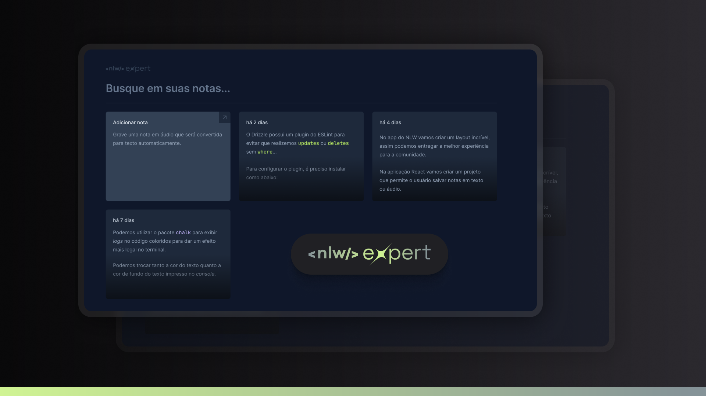

## 🚀 Expert Notes | NLW

A aplicação tem como objetivo gravar notas em áudio que serão automaticamente convertidas para texto.

- **_Desenvolvida com React, TypeScript, Tailwind e a API SpeechRecognition._**

---

## 💻 Instalação

Siga estas etapas para configurar e executar o projeto:

**1. Clone este repositório:**

```bash
git clone https://github.com/marciiosouza/nlw-expert-notes.git
```

**2. Acesse o diretório do projeto:**

```bash
cd nlw-expert-notes
```

**3. Instale as dependências:**

```bash
npm install
```

## 👨🏽‍💻 Como usar

Para iniciar o servidor de desenvolvimento, execute o seguinte comando:

```bash
npm run dev
```

Isso iniciará o servidor e você poderá acessar o aplicativo no navegador em http://localhost:5173/
